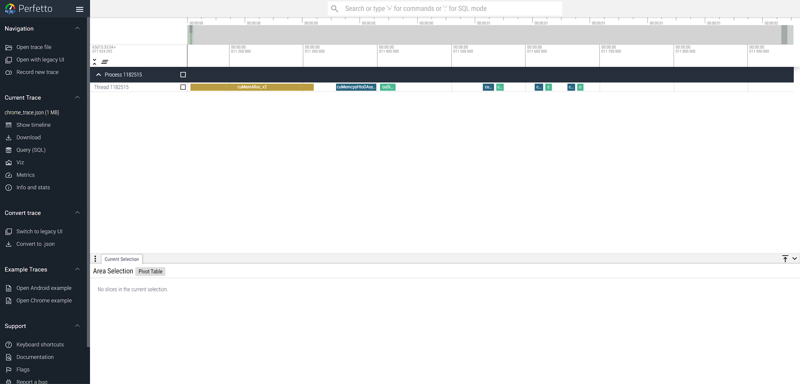
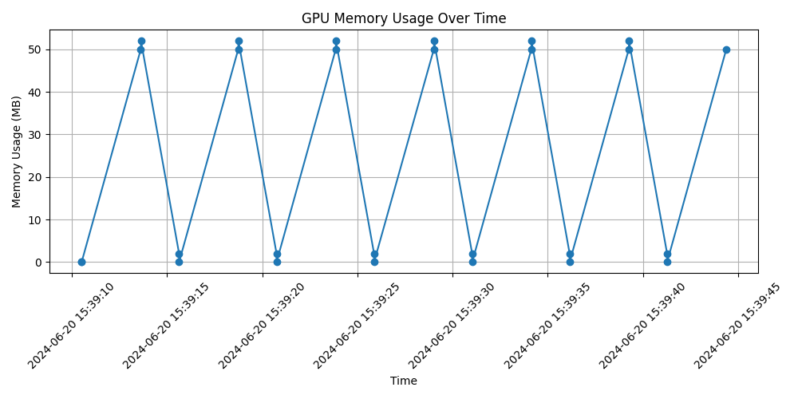

# ebpf Profiling CUDA Runtime/Driver libs
A kernel-level GPU event tracing system uses eBPF to capture CUDA runtime behaviors (memory management, kernel launches, data transfers, synchronization), enabling performance optimization for DNN/LLM training and inference. 

#### EN
```bash
#### env #####
# bcc
python cudaProfiler.py
# pytorch
python test.py
# output: logfile.txt，result: chrome_trace.json. chrome searching to visualize: chrome://tracing/。
python tracing_format.py
# auto process file logfile.txt，timing fresh to get Figure，result is trace_mem.png
python trace_mem.py
```


trace_memory


#### CN
```bash
# bcc环境
python cudaProfiler.py
# pytorch环境
python test.py
# 输出结果在logfile.txt，格式化为chrome://tracing/。结果为chrome_trace.json
python tracing_format.py
# 自动处理logfile.txt，定期刷新画图，结果为trace_mem.png
python trace_mem.py
```

# 📚 Reference
```bibtex
@patent{CN202410942419.2,
  author       = {Pengfei Chen, Gou Tan, Yuan Zhong, Chuanfu Zhang, and Zibin Zheng},
  title        = {Lightweight Non-intrusive GPU Behavior Monitoring Method, Apparatus, Device and Storage Medium},
  number       = {CN118567952A},
  year         = {2024},
  month        = {8},
  day          = {30},
  assignee     = {Sun Yat-sen University},
  application-number = {CN202410942419.2},
  filing-date  = {2024-07-15},
  classification = {G06F11/30; G06F11/32; G06F11/3024; G06F11/3089; G06F11/323},
  abstract     = {The invention employs dynamic library analysis and Berkeley Packet Filter tracing to achieve fine-grained, low-overhead GPU behavior monitoring, addressing performance bottlenecks in large-scale data processing.}
}
```

```bibtex
@patent{CN202410942419.2,
  author       = {陈鹏飞; 谭苟; 钟源; 张传富; 郑子彬},
  title        = {轻量无侵入GPU行为观测方法、装置、设备及存储介质},
  number       = {CN118567952A},
  year         = {2024},
  month        = {8},
  day          = {30},
  assignee     = {中山大学},
  application-number = {CN202410942419.2},
  filing-date  = {2024-07-15},
  classification = {G06F11/30; G06F11/32; G06F11/3024; G06F11/3089; G06F11/323},
  abstract     = {本发明通过动态库获取与伯克利包过滤器追踪技术，实现细粒度、低开销的GPU行为监控，解决大规模数据下的性能瓶颈问题。}
}
```
